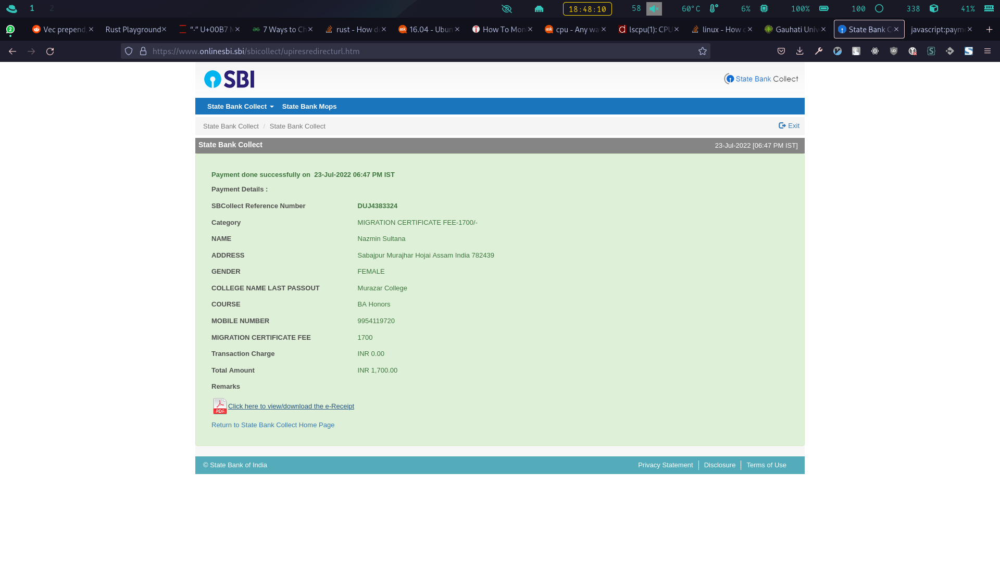

# fetchr

`fetchr` is a small CLI application that fetches and shows system information
in a terminal. It is written in Rust.

`fetchr` collects its data from `/proc` directory (whenever possible). This
makes it extremely fast. Information that cannot be accessed from the `/proc`
directory (such as GPU Info), comes from Linux system calls.



## Installation

There are two ways you can use this package.

### Pre-built Binary

Download the `fetchr` binary executable from the release page, make it
executable (`chmod +x fetchr`), and run it by executing `./fetchr`. You can
also put the executable in your `PATH` variable, and call it from anywhere. 

The binary executable is compiled with `musl libc` instead of `glibc`. This
means, it can be run on most of the Linux distributions without any additional
set-up and/or configuration.

### Build from Source

0. Install Rust (`rustc 1.62.0`), Cargo and its runtime
1. Clone this git repository using `git`
2. Once cloned, `cd` into the project root
3. Build the project using `cargo`. This will sync all external crates
4. Run the project using `cargo r`
5. To generate a release build using `musl libc`, run `cargo build --target
   x86_64-unknown-linux-musl --release`. Note that you will have to add the
   target separately by executing `rustup target add x86_64-unknown-linux-musl`


## Configuration

At this moment, `fetchr` does not provide many options for customization. The
configuration file location and key name can be customized.

To provide a custom configuration file location, use environment variable
`FETCHR_CONF` with a valid file location. Example:
`FETCHR_CONF=/path/to/conf.json fetchr`.

If this variable is not set, `fetchr` will look for
`~/config/fetchr/config.json`. If it cannot load the configuration file,
`fetchr` will run with a default configuration.

As of now, to customize the data output, you have to edit the source code. In
future, I will add support for customizing the data output too.

### Configuration file example

```json
[
  { "key": "mem", "display_name": "MEMORY" },
  { "key": "pkgs", "display_name": "PACKAGES" },
  { "key": "cpu", "display_name": "CPU CORE" },
  { "key": "shell", "display_name": "SHELL" },
  { "key": "storage", "display_name": "STORAGE" },
  { "key": "uptime", "display_name": "UPTIME" },
  { "key": "kernel", "display_name": "KERNEL" }
]
```


## How to contribute

If you are willing to improve this tool, you can do so by making a fork of this
repository, make your changes, and making a pull request back to this
repository.

## Why I built it

I am learning Rust. If you could do a code review, I will be grateful forever.
